<h1 align="center">Brightwave</h1>

---

  
  

  

---

<h2 align="center">About</h2>

I'm interested in building AI systems as infrastructure rather than standalone applications.
  
Most of my work explores modular agentic architectures, local-first software, developer tooling, and the boundaries between AI models and the systems around them. I particularly enjoy designing software where models, interfaces, and providers can be replaced without rebuilding the underlying architecture.
  
Outside of AI infrastructure, I experiment with document engines, desktop applications, rendering, automation, and developer tools.

---

<h2 align="center">
  <a href="https://github.com/Brightwav3/merely-a-responsive-kernel">Merely a Responsive Kernel</a>
</h2>

I'm building a headless, agent-first architecture for a persistent personal AI system.
  
Merely a Responsive Kernel is the canonical project root for the M.A.R.K. lineage: a model-independent assistant architecture evolving across successive runtime generations.
  
The current generation, <a href="https://github.com/Brightwav3/Assistant-mark-II">M.A.R.K. II</a>, composes independent cores for intelligence, memory, state, realtime speech, activation, tools, devices, runtime orchestration, and audio processing through explicit contracts.
  
The system is designed so that models, providers, interfaces, and hardware-specific implementations can change without taking ownership of memory, state, tools, permissions, or the assistant lifecycle with them.

  <strong>The model may change. The runtime, boundaries, and ownership should endure.</strong>

---

  

---

## M.A.R.K. Lineage

M.A.R.K. I  
Proof of Concept  
↓  
M.A.R.K. II  
Active Runtime Generation  
↓  
M.A.R.K. III  
Future Conversational Generation

- **[M.A.R.K. I](https://github.com/Brightwav3/Assistant-mark-I)** — frozen proof of concept that established the modular assistant architecture.
- **[M.A.R.K. II](https://github.com/Brightwav3/Assistant-mark-II)** — active development generation focused on capable realtime interaction, delegated intelligence, persistent memory, explicit state, deterministic tools, and increasingly robust runtime orchestration.
- **M.A.R.K. III** — future generation intended for conversational architectures that move beyond current turn-based realtime model constraints.

The full lineage, pinned generation snapshots, architecture notes, and public project site live in **[merely-a-responsive-kernel](https://github.com/Brightwav3/merely-a-responsive-kernel)**.

---

## Design Principles

- **Model-independent** — models and providers are replaceable implementation details, not architectural owners.
- **Headless-first** — the assistant exists independently of any graphical interface.
- **Agent-first** — capabilities are exposed through explicit tools, contracts, and programmable runtime boundaries.
- **Persistent by design** — memory and durable assistant state survive individual models, sessions, and providers.
- **Explicit ownership** — memory, runtime state, orchestration, permissions, tools, and external side effects have clearly separated owners.
- **Composable** — intelligence, memory, state, realtime speech, activation, tools, devices, and runtime services remain independently testable and replaceable.
- **Provider-neutral** — external AI and speech services are adapters behind stable interfaces.
- **Local-first where practical** — local execution, inspectability, and user ownership are preferred when they do not compromise capability.
- **Bounded execution** — tool use, delegated work, side effects, cancellation, and failure behavior should be explicit and controllable.
- **Hardware-aware** — deterministic software verification is separated from microphone, speaker, latency, and acoustic-echo qualification.
- **Contract-driven** — components communicate through small, explicit interfaces rather than hidden cross-module coupling.
- **Evolutionary** — each M.A.R.K. generation may replace major implementation choices without requiring the whole assistant architecture to be rebuilt.

---

## Current Focus

My current work spans several layers around persistent agents:

- **Runtime — [M.A.R.K. II](https://github.com/Brightwav3/Assistant-mark-II)** — a model-independent personal assistant runtime with delegated intelligence, persistent memory, explicit state, realtime voice, and bounded tools.
- **Policy — [.mark](https://github.com/Brightwav3/mark-lang)** — a policy and behaviour language where TypeScript implements capabilities and `.mark` controls when, why, and under what constraints an agent uses them.
- **Presence — [Mote](https://github.com/Brightwav3/mote)** — a small, self-contained avatar for AI agents, available as one HTML file or an ES module.
- **Agent interaction — [Sizel](https://github.com/Brightwav3/sizel)** — a demo electronics store and PC configurator that exposes browsing, comparison, cart, and build actions through 15 WebMCP tools. Its catalog is synthetic demo data.

The projects are separate, but they share the same design goal: models should be replaceable while state, policy, tools, and user-visible behaviour stay explicit.

---

<h2 align="center">
  <a href="https://github.com/Brightwav3/full-duplex-attempts">Full-Duplex Attempts</a>
</h2>

An atlas of my attempts at building a full-duplex voice system — one where the user and the assistant can both speak at once, and each keeps hearing the other.
  
It contains no code. Every attempt lives in its own repository. What lives here is the part that never survives inside a single project: what each attempt was trying, which half of the problem it solved, where it hit a wall, and what the wall was made of.

The central finding is that "full-duplex" describes three architectures, not two — and that conflating the middle one with the last makes an unreachable ceiling look like an unfinished integration.

| Generation | Shape | Turn detection |
| --- | --- | --- |
| 1 — Cascade | STT → chat → TTS | a silence timer in your code |
| 2 — Turn-based native | one model, audio in and out | provider-side, still on silence |
| 3 — Full-duplex | one model, continuous both ways | none — the model decides |

Three attempts are documented against five criteria: <a href="https://github.com/Brightwav3/Assistant-mark-I">Assistant Mark I</a>, which solved the native media path and bounded tools; <a href="https://github.com/Brightwav3/Assistant-mark-II">M.A.R.K. II</a>, which added delegated voice intelligence; and <a href="https://github.com/Brightwav3/voxtral-live">voxtral-live</a>, which explored cancellation, delegation, and echo work in a cascade. They are complementary approaches to one architecture rather than failed systems.

Written under three rules: every architectural claim cites the file and construct it came from, every page names the date and commit it was read against, and nothing is vendored — links only.

  <strong>Some ceilings are in the model, not in the architecture.</strong>

---

<h2 align="center">Selected Projects</h2>

| Project                                                                                    | Description                                                                                                                      |
| ------------------------------------------------------------------------------------------ | -------------------------------------------------------------------------------------------------------------------------------- |
| **[Sizel](https://github.com/Brightwav3/sizel)** *(current)*                               | A demo electronics store and PC configurator for shoppers and browser agents, with 15 WebMCP tools and synthetic catalog data. |
| **[Mote](https://github.com/Brightwav3/mote)** *(current)*                                 | A small expressive avatar for AI agents, shipped as one self-contained HTML file or an ES module.                              |
| **[.mark](https://github.com/Brightwav3/mark-lang)** *(current)*                           | A policy and behaviour language for persistent agents. TypeScript implements capabilities; `.mark` governs agent behaviour.     |
| **[FreeDF](https://github.com/Brightwav3/custom-pdf-engine)**                              | A local-first PDF engine built around immutable operations, stable contracts, and equivalent Python, HTTP, and JSON interfaces. |
| **[One Tool](https://github.com/Brightwav3/One-tool-to-rule-them-all)**                    | A local-first Windows desktop app for file conversion and document editing.                                                   |
| **[semantic-backlinks](https://github.com/Brightwav3/semantic-backlinks)**                 | An Obsidian plugin for semantic note linking using local embeddings through Ollama / LM Studio or the OpenAI API.                |
| **[advanced-bases](https://github.com/Brightwav3/advanced-bases)**                         | Notion-style Cards Compact, Feed, and Timeline views for Obsidian Bases.                                                       |
| **[clipping-note](https://github.com/Brightwav3/clipping-note)**                           | An Obsidian plugin that creates a Clipping note from a template with one click.                                               |
| **[Coding-Agent-Theme](https://github.com/Brightwav3/Coding-Agent-Theme)**                 | A custom theme for coding-agent interfaces.                                                                                      |
