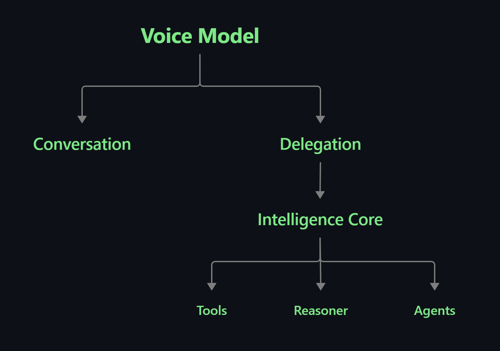

<h1 align="center">Brightwave</h1>

Building modular AI systems, developer infrastructure, and local-first software designed to outlive any single model or interface.

---

<h2 align="center">About</h2>

I'm interested in building AI systems as infrastructure rather than standalone applications.
  
Most of my work explores modular agentic architectures, local-first software, developer tooling, and the boundaries between AI models and the systems around them. I particularly enjoy designing software where models, interfaces, and providers can be replaced without rebuilding the underlying architecture.
  
Outside of AI infrastructure, I experiment with document engines, desktop applications, rendering, automation, and developer tools.

---

<h2 align="center">
  <a href="https://github.com/Brightwav3/merely-a-responsive-kernel">Merely a Responsive Kernel</a>
</h2>

I'm building a headless, agent-first architecture for a persistent personal AI system.
  
Merely a Responsive Kernel is the canonical project root for the M.A.R.K. lineage: a model-independent assistant architecture evolving across successive runtime generations.
  
The current generation, <a href="https://github.com/Brightwav3/Assistant-mark-II">M.A.R.K. II</a>, composes independent cores for intelligence, memory, state, realtime speech, activation, tools, devices, runtime orchestration, and audio processing through explicit contracts.
  
The system is designed so that models, providers, interfaces, and hardware-specific implementations can change without taking ownership of memory, state, tools, permissions, or the assistant lifecycle with them.

  <strong>The model may change. The runtime, boundaries, and ownership should endure.</strong>

---

  

---

## M.A.R.K. Lineage

M.A.R.K. I  
Proof of Concept  
↓  
M.A.R.K. II  
Active Runtime Generation  
↓  
M.A.R.K. III  
Future Conversational Generation

- **[M.A.R.K. I](https://github.com/Brightwav3/Assistant-mark-I)** — frozen proof of concept that established the modular assistant architecture.
- **[M.A.R.K. II](https://github.com/Brightwav3/Assistant-mark-II)** — active development generation focused on capable realtime interaction, delegated intelligence, persistent memory, explicit state, deterministic tools, and increasingly robust runtime orchestration.
- **M.A.R.K. III** — future generation intended for conversational architectures that move beyond current turn-based realtime model constraints.

The full lineage, pinned generation snapshots, architecture notes, and public project site live in **[merely-a-responsive-kernel](https://github.com/Brightwav3/merely-a-responsive-kernel)**.

---

## Design Principles

- **Model-independent** — models and providers are replaceable implementation details, not architectural owners.
- **Headless-first** — the assistant exists independently of any graphical interface.
- **Agent-first** — capabilities are exposed through explicit tools, contracts, and programmable runtime boundaries.
- **Persistent by design** — memory and durable assistant state survive individual models, sessions, and providers.
- **Explicit ownership** — memory, runtime state, orchestration, permissions, tools, and external side effects have clearly separated owners.
- **Composable** — intelligence, memory, state, realtime speech, activation, tools, devices, and runtime services remain independently testable and replaceable.
- **Provider-neutral** — external AI and speech services are adapters behind stable interfaces.
- **Local-first where practical** — local execution, inspectability, and user ownership are preferred when they do not compromise capability.
- **Bounded execution** — tool use, delegated work, side effects, cancellation, and failure behavior should be explicit and controllable.
- **Hardware-aware** — deterministic software verification is separated from microphone, speaker, latency, and acoustic-echo qualification.
- **Contract-driven** — components communicate through small, explicit interfaces rather than hidden cross-module coupling.
- **Evolutionary** — each M.A.R.K. generation may replace major implementation choices without requiring the whole assistant architecture to be rebuilt.

---

## Current Focus

M.A.R.K. II is the active implementation line.

Its current direction includes:

- realtime interaction through native voice-model sessions;
- asynchronous delegation from the realtime layer into deeper reasoning;
- persistent memory with controlled retrieval and provenance;
- explicit runtime and world state;
- bounded deterministic tool execution;
- model and provider routing behind stable contracts;
- device and host capability boundaries;
- cancellation, recovery, correlation, and background completion;
- context and orchestration infrastructure that remains independent of the active model;
- audio coordination and acoustic echo cancellation;
- architecture that can accommodate future full-duplex conversational models without redesigning the entire system.

The goal is not to build around one model generation.

It is to build a runtime capable of surviving the next one.

---

<h2 align="center">
  <a href="https://github.com/Brightwav3/full-duplex-attempts">Full-Duplex Attempts</a>
</h2>

An atlas of my attempts at building a full-duplex voice system — one where the user and the assistant can both speak at once, and each keeps hearing the other.
  
It contains no code. Every attempt lives in its own repository. What lives here is the part that never survives inside a single project: what each attempt was trying, which half of the problem it solved, where it hit a wall, and what the wall was made of.

The central finding is that "full-duplex" describes three architectures, not two — and that conflating the middle one with the last makes an unreachable ceiling look like an unfinished integration.

| Generation | Shape | Turn detection |
| --- | --- | --- |
| 1 — Cascade | STT → chat → TTS | a silence timer in your code |
| 2 — Turn-based native | one model, audio in and out | provider-side, still on silence |
| 3 — Full-duplex | one model, continuous both ways | none — the model decides |

Two attempts are documented against five criteria: <a href="https://github.com/Brightwav3/Assistant-mark-I">Assistant Mark I</a>, which solved the media half and cannot act, and <a href="https://github.com/Brightwav3/voxtral-live">voxtral-live</a>, which solved the application half and cannot stop taking turns. They are complementary halves of one architecture rather than two failed systems.

Written under three rules: every architectural claim cites the file and construct it came from, every page names the date and commit it was read against, and nothing is vendored — links only.

  <strong>Some ceilings are in the model, not in the architecture.</strong>

---

<h1 align="center">Other Featured Projects</h1>

| Project                                                                                    | Description                                                                                                                      |
| ------------------------------------------------------------------------------------------ | -------------------------------------------------------------------------------------------------------------------------------- |
| **[FreeDF](https://github.com/Brightwav3/custom-pdf-engine)** *(in development)*           | A local-first PDF engine built around immutable operations, stable contracts, and equivalent Python, HTTP, and JSON interfaces.  |
| **[One Tool](https://github.com/Brightwav3/One-tool-to-rule-them-all)** *(in development)* | A desktop workspace for document conversion and editing designed around reusable backend services and agent-friendly automation. |
| **[semantic-backlinks](https://github.com/Brightwav3/semantic-backlinks)**                 | An Obsidian plugin for semantic note linking using local embeddings through Ollama / LM Studio or the OpenAI API.                |
| **[liquid-metal-effect](https://github.com/Brightwav3/liquid-metal-effect)**               | A WebGL liquid-metal rendering experiment with a complete implementation and technical documentation.                            |
| **[Invoicee](https://github.com/Brightwav3/invoicee)**                                     | A prototype Czech invoicing application featuring a browser-based invoice editor.                                                |
| **[personal-portfolio](https://github.com/Brightwav3/personal-portfolio)**                 | A literary-inspired portfolio focused on interaction, animation, and visual storytelling.                                        |
| **[Coding-Agent-Theme](https://github.com/Brightwav3/Coding-Agent-Theme)**                 | A custom theme for coding-agent interfaces.                                                                                      |

---

<h1 align="center">At a Glance</h1>

  
  

  

  <picture>
    <source
      media="(prefers-color-scheme: dark)"
      srcset="https://raw.githubusercontent.com/Brightwav3/Brightwav3/output/github-contribution-grid-snake-dark.svg"
    />
    <source
      media="(prefers-color-scheme: light)"
      srcset="https://raw.githubusercontent.com/Brightwav3/Brightwav3/output/github-contribution-grid-snake.svg"
    />
    
  </picture>

-

